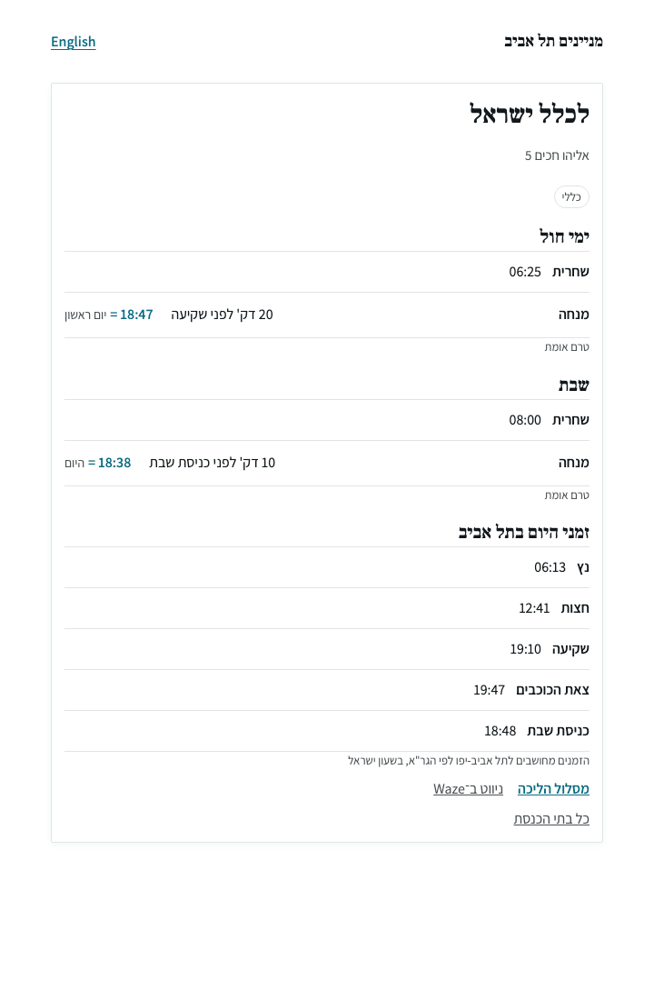

# TLV Minyanim

**Where can I daven in the next 40 minutes?**

Nobody in Tel Aviv can currently answer that. There are synagogue directories —
they list buildings, addresses, phone numbers. What they cannot do is sort
today's prayer times into a timeline, because most of those times are not clock
times at all. They are *rules*: twenty minutes before sunset, ten minutes before
candle lighting, at dawn.

This is a bilingual (Hebrew/English) site for the person who is **not where they
usually pray** — a visitor, a business traveller, someone saying kaddish in an
unfamiliar city.

<p align="center">
  
</p>

Read that Mincha row: **`20 דק' לפני שקיעה` = `18:47`**. The rule is stored; the
clock time is computed for today. Tomorrow it will say something else, and it
will still be right — because sunset moved, not because anyone edited a row.

---

## The one idea

**A minyan time is a structured value, never a display string.**

```ts
type MinyanTime =
  | { kind: 'fixed';    time: string }                       // "13:30"
  | { kind: 'relative'; anchor: Zman; offsetMinutes: number } // shkia − 20
  | { kind: 'unknown';  rawText: string }                     // "בזמן"
```

LA Jewish Times — the closest comparable — stores relative times as the literal
text `"~25 Min before Netz"`. Those minyanim are therefore invisible to its own
next-minyan feature: a string cannot be sorted into a timeline. That single
decision breaks the only feature that matters.

The invariant is enforced in **Postgres**, not just TypeScript:

```sql
CONSTRAINT minyan_time_shape CHECK (
  CASE kind
    WHEN 'fixed'    THEN fixed_time IS NOT NULL AND anchor IS NULL AND …
    WHEN 'relative' THEN anchor IS NOT NULL AND offset_minutes IS NOT NULL AND …
    WHEN 'unknown'  THEN raw_text IS NOT NULL AND fixed_time IS NULL AND …
  END
)
```

An import script cannot write in SQL what the types forbid in the app. All three
malformed shapes were tried against a live database and rejected.

## The third kind matters most

About 60% of the source data says only `בזמן` — "at the proper time" — with no
offset. That is `kind: 'unknown'`, and **it is never guessed**.

A hallucinated Mincha sends someone across a neighbourhood to an empty room, and
it does so with a confident-looking number on the page. A blank is honest. The
parser has a test asserting that two shuls with identical field shapes — one
stating `shkia − 20`, one saying `בזמן` — do not let the second inherit the
first.

The site says so out loud rather than hiding it:

> **טעון בדיקה — לא מאושר**
> המקור לא ברור, והשעות האלה לא אושרו. **אל תסתמכו עליהן.**

## Where it stands

| | |
|---|---|
| Parser | Hebrew free text → structured values. All 26 raw fields parse, zero leftovers |
| Data | 16 synagogues, 65 minyanim — 42 fixed, 19 unknown, 4 relative. 1 verified against its own notice board |
| Zmanim | `@hebcal/core`, GRA, resolved at read time and never stored |
| Tests | 284, including edge cases asserted against published luachot |
| Contrast | AA in both modes — 130 elements, 0 failures, worst 5.05 light / 5.73 dark |

**Not built:** geo/radius search, the nightly refresh job, and any deployment —
the site currently runs locally only.

**The real gap is not code.** Shacharit is known for every shul. **Mincha is 69%
unknown**, and exactly one synagogue in the neighbourhood publishes a real
offset. No feature closes that; twelve conversations with gabbaim would.

---

## A few decisions worth the detour

**Candle lighting in Tel Aviv is `shkia − 22`, not 20.** `@hebcal/core` ships 20
for the Tel Aviv geoname and Hebcal's own pages print 20 — but the Tel Aviv-Yafo
Religious Council, the authority for exactly these synagogues, publishes 22, and
MyZmanim labels it `22 דקות קודם השקיעה`. Checked against all 34 published
Fridays of 5786 falling in 2026: no date fits 20, 21 or 23. Where published
authorities disagree, take the earlier — two minutes early costs nothing, two
minutes late is chillul Shabbat.

**`tzeit` names two different times, so no tzeit minyan is published.** On a
luach, יציאת שבת is the stringent 8.5° value. A synagogue writing צאת הכוכבים on
its Arvit line means the nightfall it actually davens at — up to 26 minutes
earlier. Resolving one against the other listed a real minyan 26 minutes late,
so the anchor is kept and the record held back until a gabbai settles it.

**`מנחה 1:30` means 13:30, and that is reading rather than guessing.** Mincha at
01:30 does not exist, so the time is stated and only the clock convention is
open. Every such shift is recorded in `clockNormalisation` and stays queryable.
Where *neither* reading is possible, the record is flagged and withheld.

**Hebrew sorts with `COLLATE "C"`.** The cluster default is `en_US.UTF-8`, which
orders Hebrew into nonsense — it put `המרכזי` before `אוהל`. Invisible to anyone
not reading Hebrew.

**Contrast is measured by painting a pixel, never by reading a colour string.**
`color-mix()` computes in oklab, and a regex reads `oklab(0.72 0.13 0.11)` as
near-black — 81 elements on the homepage are affected. See
`scripts/contrast-audit.js`.

**Tests never assert that a library returns what the library returns.** Expected
zmanim come from published luachot, sourced independently of this code
(`docs/zmanim-ground-truth.md`). Reverting candle lighting to 20 fails six tests;
switching tzeit to the 7.083° opinion fails ten.

---

## Stack

Next.js (App Router) + TypeScript, server-rendered — every synagogue page must be
crawlable. Postgres + PostGIS for real geo queries. `@hebcal/core` for zmanim,
never hand-rolled. Zero runtime dependencies in the parser, which is a standalone
module with its own tests.

Bilingual routing (`/he`, `/en`) from the first commit, because retrofitting it
means losing every ranking. CSS logical properties only; `Asia/Jerusalem`
throughout, where the Hebrew date rolls at sunset.

## Running it

```bash
brew install postgresql@17 postgis && brew services start postgresql@17
createdb tlv_minyanim
psql -v ON_ERROR_STOP=1 -d tlv_minyanim -f db/migrations/0001_init.sql
psql -v ON_ERROR_STOP=1 -d tlv_minyanim -f db/migrations/0002_shiurim_and_parse_issues.sql
psql -v ON_ERROR_STOP=1 -d tlv_minyanim -f db/migrations/0003_minyan_nusach.sql
psql -v ON_ERROR_STOP=1 -d tlv_minyanim -f db/migrations/0004_erev_shabbat_day_type.sql
psql -v ON_ERROR_STOP=1 -d tlv_minyanim -f db/migrations/0005_synagogue_nusachim.sql
psql -v ON_ERROR_STOP=1 -d tlv_minyanim -f db/migrations/0006_minyan_validity.sql
```

Put `DATABASE_URL=postgres:///tlv_minyanim` in `.env.local`, then:

```bash
npm install && npm run import:seed && npm run dev
```

| | |
|---|---|
| `npm test` | the suite (284) |
| `npm run typecheck` | parser and app |
| `npm run import:seed` | load seed data through the parser — idempotent |
| `npm run coverage` | how much of the source actually parsed |

## Layout

```
src/minyan-times/   the parser — standalone, no framework, no runtime deps
src/zmanim/         rules to instants. Computes nothing itself; @hebcal/core does
src/db/             plain SQL, no ORM — the schema is the source of truth
src/app/[locale]/   server-rendered pages, Hebrew and English
db/migrations/      schema. The time invariant is a CHECK constraint here
docs/               zmanim ground truth, sourced independently of the code
```

`CLAUDE.md` is the project's binding contract — the invariants, the taxonomy, and
the decisions that must not be undone by accident.

## Two things that will trip you up

**`data/seed-ramat-aviv.json` is gitignored and must stay that way.** It carries
gabbai and rabbi names and personal phone numbers — personal data under Israeli
privacy law. There are no columns for them in the schema, the importer deletes
those fields at the read boundary, and nothing logs or fixtures them.

**Do not serve the repo root over HTTP.** `python3 -m http.server` does not read
`.gitignore`. The artboard preview in `.claude/launch.json` is bound to
`127.0.0.1` for exactly this reason.

## Licence

MIT for the code. The photographs are not licensed for reuse, and the synagogue
data derives from the Tel Aviv-Yafo municipality GIS layer and Religious Council
under their own terms. See [LICENSE](LICENSE).
